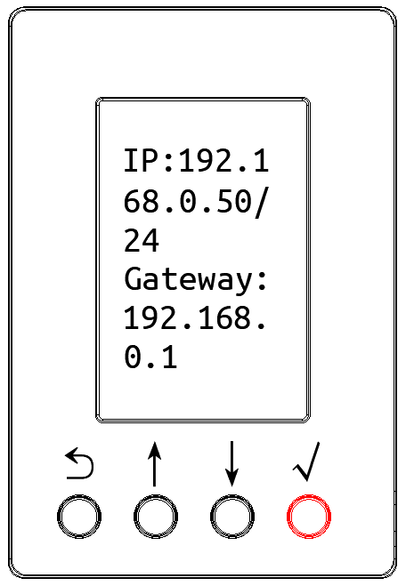
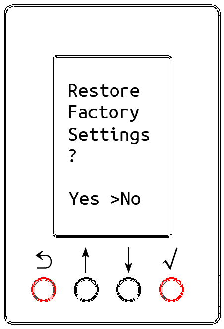

# LCD Display and Button Instructions

## Normal Display

In normal display mode, the device's LCD screen displays the temperature and humidity parameter values.

When equipped with different air quality sensors, such as CO₂, TVOC, etc., it will display each air quality monitoring value in turn. You can also press the **↓** or **↑** buttons to switch the display content.

{width=210}

## Parameter Interface

Press and hold the **√** button for 1 second to enter the device parameter interface, where you can view parameter information such as the device's IP address, device time, MAC address, Wi-Fi network, and firmware version.

{width=160}

## Factory Reset

Press and hold the **⟲** and **√** buttons simultaneously for 5 seconds to enter the factory reset interface. The process of restoring factory settings and restarting takes about ten seconds.

{width=160}
