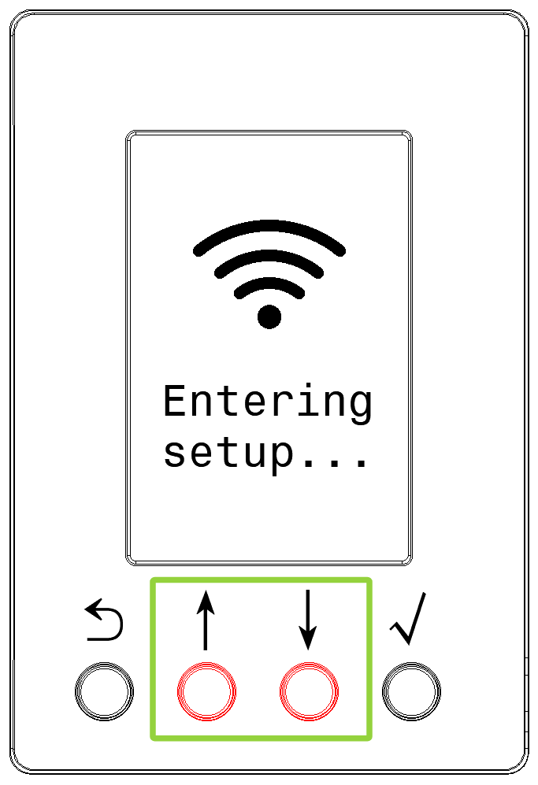
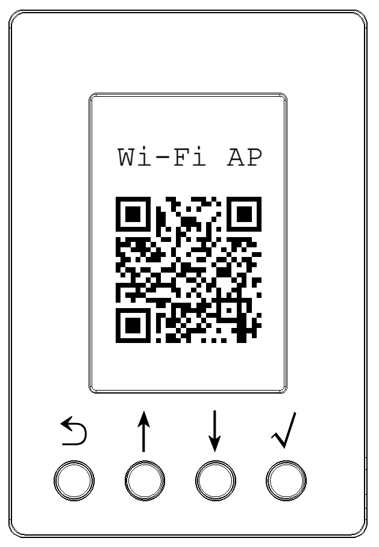
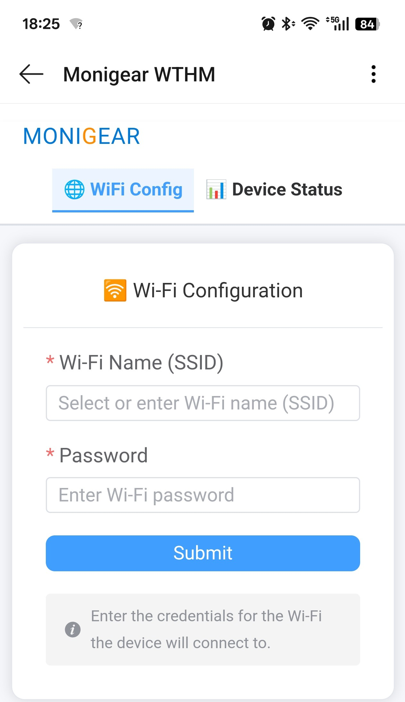

# Wi-Fi Configuration Instructions

To connect the WTHM device to the network, you need to configure the currently available Wi-Fi network information for it, including the Wi-Fi AP's network name (SSID) and password.

⚠️ **Note**: The WTHM device only supports 2.4G Wi-Fi networks and does not currently support 5G Wi-Fi networks.

## 1. Enter Configuration Mode

Press and hold the **↑** and **↓** buttons on the WTHM device panel for 3 seconds to enter the Wi-Fi configuration process.
You can release the buttons after the LCD screen displays "Entering setup...".

{width=180}

When the LCD screen displays the **Wi-Fi AP QR code**, it means the device has successfully entered Wi-Fi configuration mode.

{width=180}

## 2. Use a mobile phone (or Pad) for configuration

Scan the QR code displayed on the device's LCD screen with your mobile phone (or Pad).

⚠️ **Note**: Please use the iOS / Android **system-level** QR code scanning function. Common options are:

- The QR code scanning function in the native camera application
- The QR code scanning function in **Settings** -> **WLAN**
- The QR code scanning function in the system browser

During the process of scanning the QR code, if the mobile phone system prompts you to connect to the "🛜 WTHM-xxx" Wi-Fi network, please select **Yes**.

After the mobile phone successfully connects to the WTHM device's Wi-Fi network, most mobile phone systems will automatically jump to the configuration page.

{width=360}

On the configuration page, enter the Wi-Fi network name (SSID) and password that the device is to connect to, and then click **Submit** to submit the configuration.

⚠️ **Note**: If your mobile phone fails to jump to the configuration page normally, please refer to this [detailed guide](./detailed-instructions.md).

## 3. Check the Wi-Fi connection status on the device

After completing the configuration operation, the WTHM device will automatically exit the configuration mode and try to connect to the configured Wi-Fi network.

You can check the Wi-Fi network connection status on the device's LCD screen.
