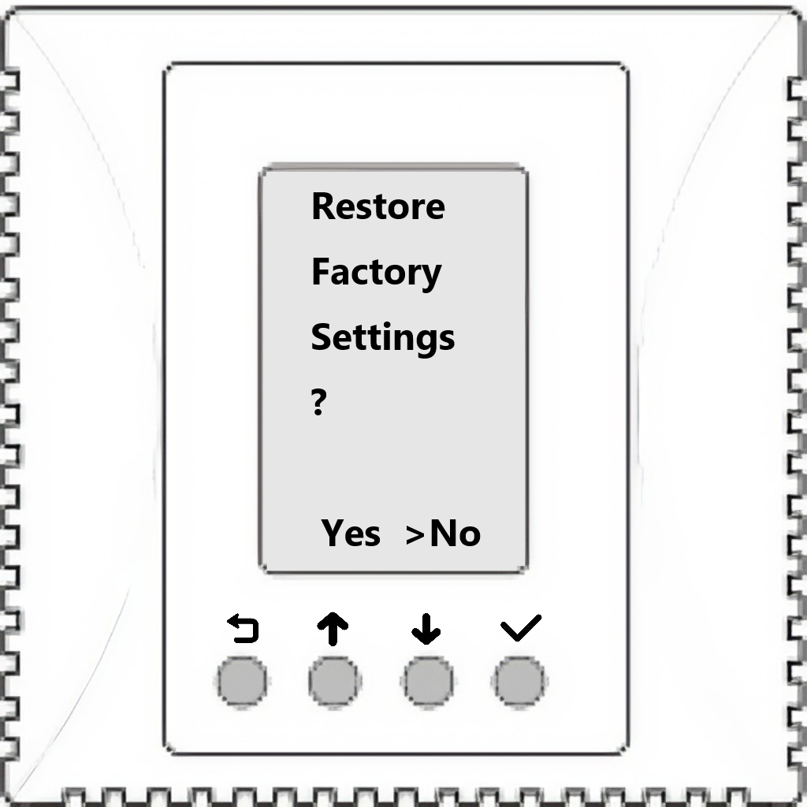
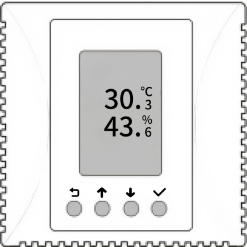
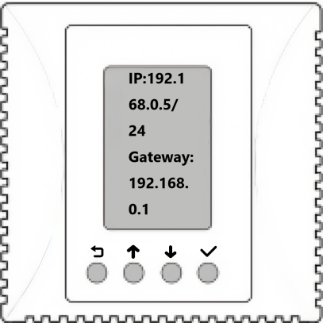
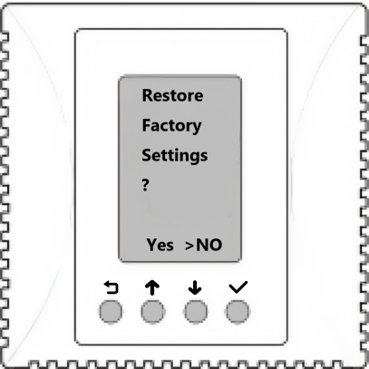

**Simple instruction manual**

1.  **Power and network interface**

- Supports standard USB Type-C 5V power supply.

- Supports DC power terminal input, rated input voltage DC12V, range DC9\~28V.

2.  **TTL 3.3V UART Serial Configuration Interface**

| Pin | Description |
|-----|------------|
| TXD | Transmit pin |
| RXD | Receive pin |
| GND | Signal ground pin |

Use this alternate interface to configure device when it can't be configured over the network.

3.  **Wireless Communication**

Compatible with the 2.4G WLAN 802.11 b/g/n standard.

**Display and Button usage**

Normally, the temperature and humidity pages will be displayed, and those with gas detection will be displayed in turn.

Press and hold the√button for 1 second to view parameter information such as the device IP address, mask, gateway, firmware version, firmware date, and MAC address.

Press and hold both the middle↓and↑buttons simultaneously for 5 seconds to enter the Wi-Fi configuration interface. Use a smartphone or tablet to scan the QR code displayed on the screen to access the Wi-Fi setup program and configure the SSID and password of the Wi-Fi AP to which the device will connect during operation.

Press and hold both the **⟲** and√buttons simultaneously for 5 seconds to enter the factory reset interface, and the process of factory reset takes dozens of seconds.

{width="1.8506944444444444in"
height="1.8506944444444444in"}
{width="1.8506944444444444in"
height="1.8506944444444444in"}
{width="1.8506944444444444in"
height="1.8506944444444444in"}

**接线说明**

4.  **电源供电**

- 支持标准USB Type-C 5V供电。

- 支持DC电源端子供电，额定输入电压DC12V，范围DC9\~28V。

5.  **TTL 3.3V uart串行配置接口**

| 引脚 | 功能描述 |
|------|----------|
| TXD  | Transmit pin |
| RXD  | Receive pin |
| GND  | Signal ground pin |

当无法通过网络配置设备时，使用此备用接口配置和调试设备。

6.  **无线通讯**

Compatible with 2.4G WLAN 802.11 b/g/n standard。

**屏幕和按键说明**

常规显示模式下，设备液晶屏上显示温度、湿度参数值。当配备不同的空气质量传感器，如CO2，TVOC等，会依次显示各项空气质量监测值。

按住√按键1s查看设备IP地址、掩码、网关、固件版本、固件日期、MAC等参数信息。

同时按住中间的↓和↑按键5秒钟进入Wi-Fi配网界面，用手机或Pad扫描屏幕上显示的二维码进入Wi-Fi配网程序，设置设备运行时所要连接的Wi-Fi AP的SSID和密码信息。

同时按住两侧的**⟲**和√按键5秒钟进入恢复出厂设置界面。设置恢复出厂设置并重启整个过程持续约十来秒。

{width="1.8506944444444444in"
height="1.8506944444444444in"}
{width="1.8506944444444444in"
height="1.8506944444444444in"}
{width="1.8506944444444444in"
height="1.8506944444444444in"}

