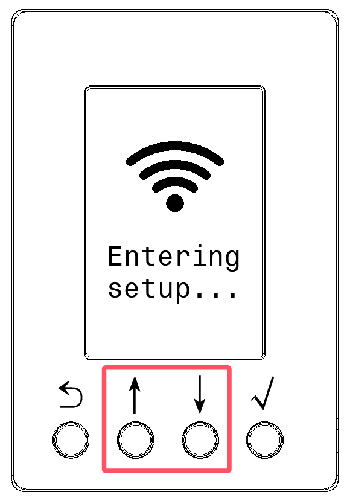
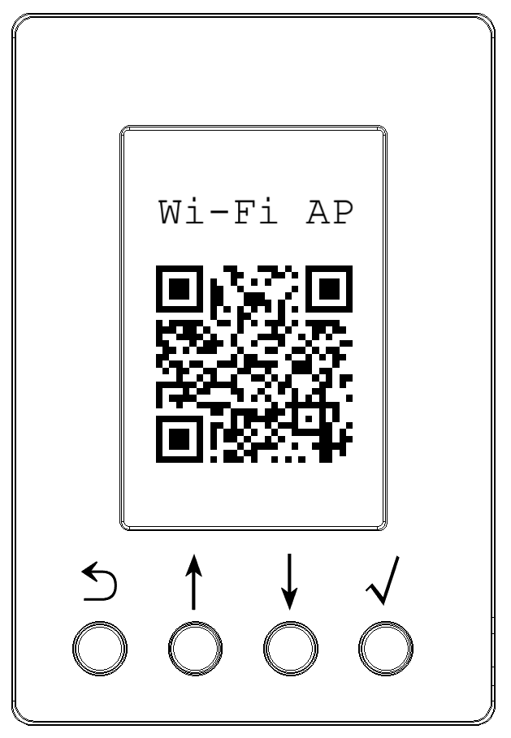
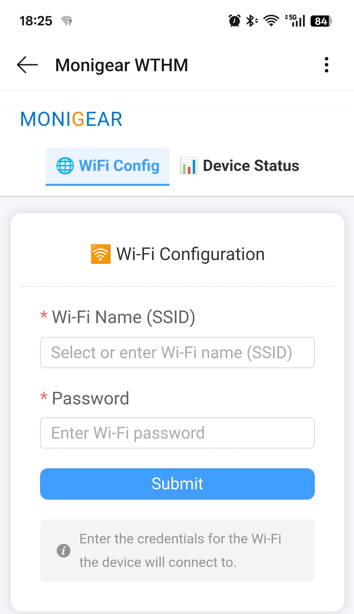

# Wi-Fi配网说明

为使 WTHM 设备联网，你需要为其配置当前可用的Wi-Fi网络信息，包括Wi-Fi AP的网络名称（SSID）和密码。

⚠️ **注意**： WTHM 设备只支持2.4G Wi-Fi网络，暂不支持5G Wi-Fi网络。

## 1. 进入配网模式

在 WTHM 设备面板上 ***同时*** 按住 **↑** 和 **↓** 按键3秒钟进入Wi-Fi配网流程。
当液晶屏显示 "Entering setup..." 后可松开按键。

{width=180}

当液晶屏显示 **Wi-Fi AP 二维码** 时表示设备已成功进入Wi-Fi配网模式。

{width=180}

## 2. 使用手机（或Pad）进行配网

用手机（或Pad）扫描设备液晶屏上显示的二维码。

⚠️ **说明**：请使用 iOS / Android **系统级** 二维码扫描功能，常见可选的有：

- 系统原生相机应用里的二维码扫描功能
- 系统 ⚙️  **设置** -> 🛜 **WLAN** 里的二维码扫描功能
- 系统浏览器里的二维码扫描功能

扫描二维码过程手机系统如有提示连接 「🛜 WTHM-xxx」 Wi-Fi网络的选项，请选择 **是** 。

手机成功连接上 WTHM 设备的Wi-Fi网络后，大部分手机系统会自动跳转到配置页面。

{width=360}

在配置页面里输入设备所要连接的Wi-Fi网络名称（SSID）和密码后，点击 **Submit** 提交配置。

⚠️ **说明**：如你的手机未能正常跳转到配置页面，请参考这一[详细指引](./detailed-instructions.md) 。

## 3. 设备上查看Wi-Fi连接状态

完成配网操作后 WTHM 设备会自动退出配网模式，并尝试连接所配置的Wi-Fi网络。

你可在设备液晶屏幕上查看Wi-Fi网络连接状态。

