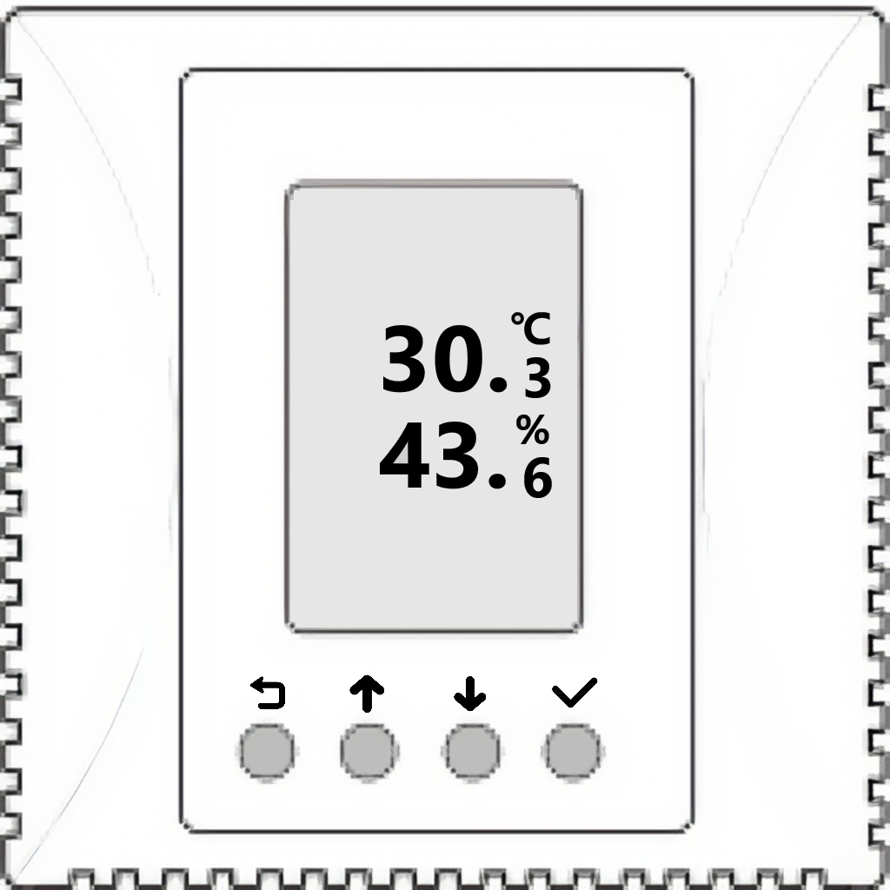
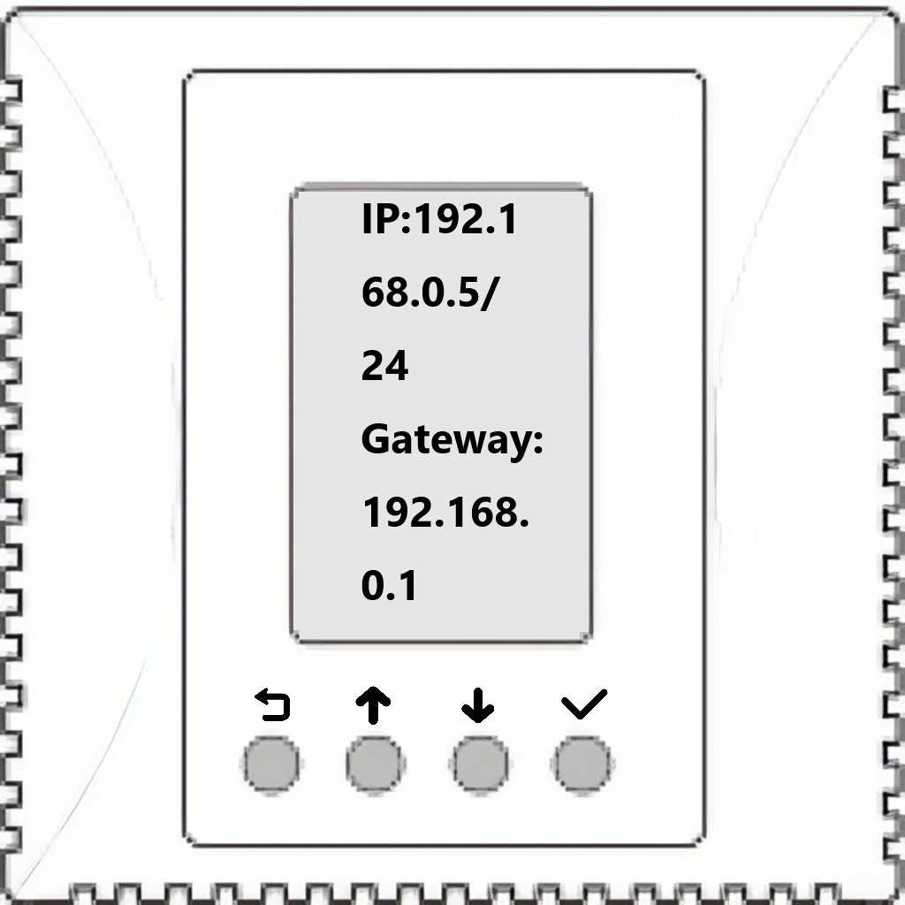
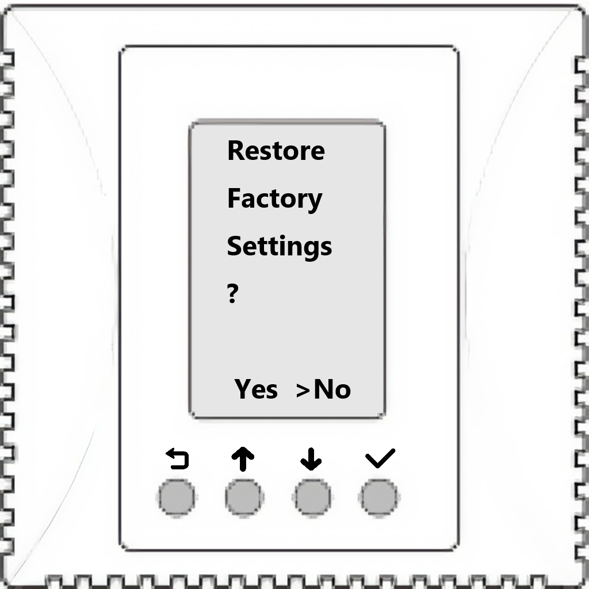

# Wi-Fi配网及按键说明

常规显示模式下，设备液晶屏上显示温度、湿度参数值。当配备不同的空气质量传感器，如CO2，TVOC等，会依次显示各项空气质量监测值。

按住√按键1s查看设备IP地址、掩码、网关、固件版本、固件日期、MAC等参数信息。

同时按住中间的↓和↑按键5秒钟进入Wi-Fi配网界面，用手机或Pad扫描屏幕上显示的二维码进入Wi-Fi配网程序，设置设备运行时所要连接的Wi-Fi AP的SSID和密码信息。

同时按住两侧的**⟲**和√按键5秒钟进入恢复出厂设置界面。设置恢复出厂设置并重启整个过程持续约十来秒。

{width=180}
{width=180}
{width=180}
